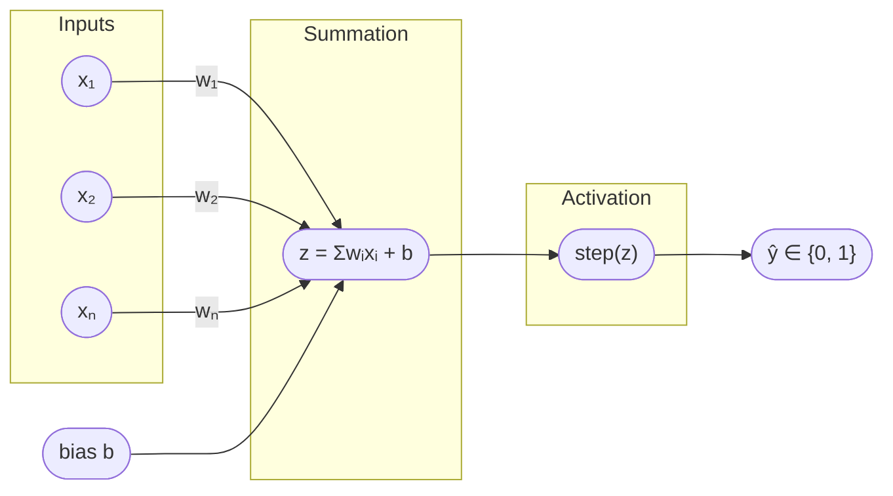
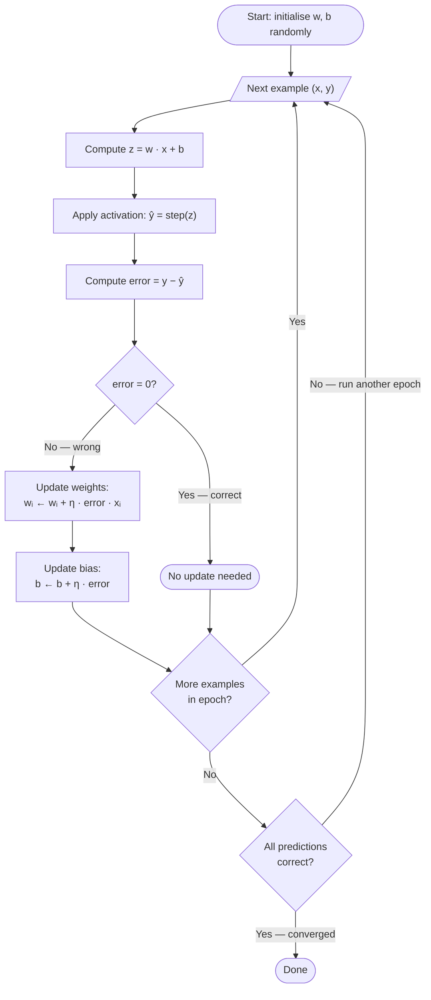
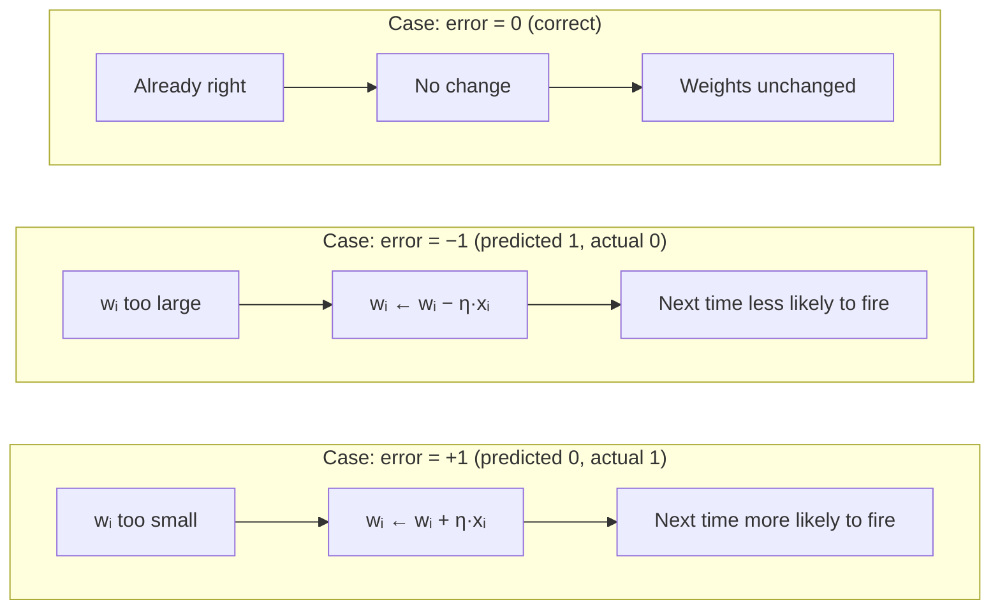
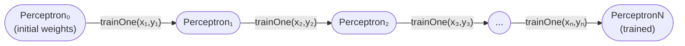

# Perceptron Diagrams

---

## 1. Structure — Forward Pass



**ASCII equivalent** (for environments that don't render Mermaid):

```
 x₁ ──(w₁)──┐
             │
 x₂ ──(w₂)──┤
             ├──► [ z = Σwᵢxᵢ + b ] ──► [ step(z) ] ──► ŷ
 xₙ ──(wₙ)──┤
             │
 b  ─────────┘
```

---

## 2. Training Loop — One Epoch



---

## 3. Weight Update — What Changes and Why



---

## 4. Decision Boundary — 2D Geometric View

For a 2-input perceptron, the decision boundary is the line `w₁x₁ + w₂x₂ + b = 0`.  
Everything above the line → ŷ = 1. Everything below → ŷ = 0.

### AND Gate (linearly separable ✓)

```
  x₂
  1 │  · (0,1)      ✗       ★ (1,1)
    │
  0 │  ✗ (0,0)              · (1,0)  ✗
    └──────────────────────────────── x₁
         0                  1

  ✗ = class 0   ★ = class 1

  Decision boundary separates ★(1,1) from the three ✗ points:

  x₂
  1 │  ·            ╲       ★
    │                ╲
  0 │  ✗              ╲     ·
    └──────────────────╲──────── x₁
                        ╲
```

### XOR Gate (NOT linearly separable ✗)

```
  x₂
  1 │  ★ (0,1)              · (1,1)  ✗
    │
  0 │  · (0,0)  ✗           ★ (1,0)
    └──────────────────────────────── x₁

  No single straight line can separate the two ★ points from the two ✗ points.
  The positive class is diagonal — requires a hidden layer (Phase 4).
```

---

## 5. Immutable Training — Scala Model

Each call to `trainOne` produces a **new** `Perceptron`. Training over a dataset is a fold:



In code:

```scala
val trained = dataset.foldLeft(initialPerceptron) { case (p, (input, label)) =>
  p.trainOne(input, label)
}
```

Every intermediate `Perceptron` is still accessible if you fold into a `List` instead — useful for plotting loss over epochs.
